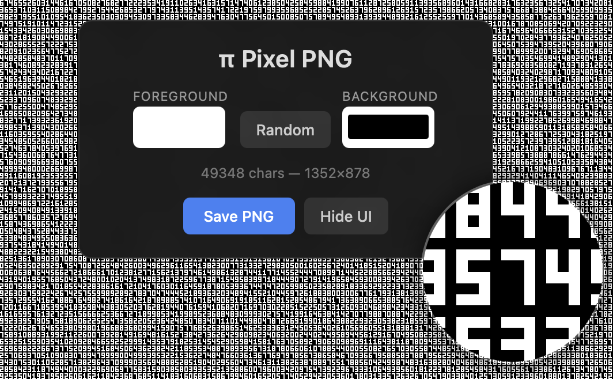

# piday.click

Generate wallpaper-sized PNGs filled with the digits of Pi, rendered in a tiny 3x5 pixel font.



## Features

- **Pixel-perfect Pi** — digits rendered in a minimal 3x5 font (4x6 cells with 1px margin)
- **Custom colors** — pick foreground/background or hit Random for curated palettes
- **Instant PNG** — right-click to save, or use the Save PNG button
- **Magnifier loupe** — hover to see zoomed pixels under the cursor
- **Auto-sizing** — defaults to your screen resolution, re-renders on display change
- **213K digits** — enough to fill a Pro Display XDR

## Run locally

```
python3 -m http.server 8080
```

Or with Docker:

```
docker compose up --build
```

Then open [http://localhost:8080](http://localhost:8080).

## Deploy

Deploy to AWS, GCP, or Digital Ocean with [Defang](https://defang.io):

```
defang compose up
```

The Compose file uses the `x-defang-static-files` extension for serving files using CDN instead of compute,
which is a feature currently only avaiable on AWS.

## Files

| File | Description |
|---|---|
| `index.html` | Single-file app (HTML + CSS + JS) |
| `pi_digits.txt` | 213,000 digits of Pi |
| `Dockerfile` | Nginx Alpine container |
| `compose.yaml` | Docker Compose / Defang config |

## License

MIT
